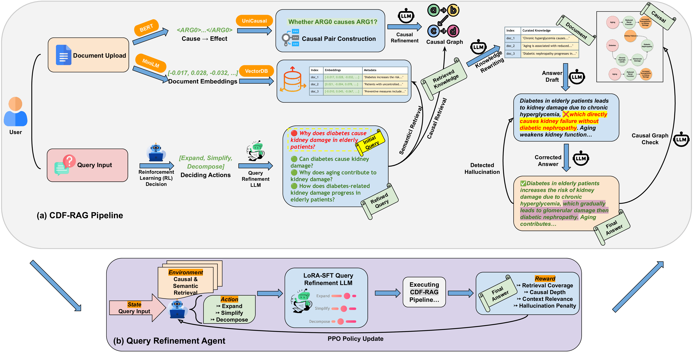

# CDF-RAG: Causal Dynamic Feedback for Adaptive Retrieval-Augmented Generation

**Elahe Khatibi\***, **Ziyu Wang\***, Amir M. Rahmani  
*University of California, Irvine*  
📄 [arXiv:2504.12560](https://arxiv.org/abs/2504.12560)  
\* Equal contribution

---

## 🧠 Abstract

Retrieval-Augmented Generation (RAG) has significantly enhanced large language models (LLMs) in knowledge-intensive tasks by incorporating external knowledge retrieval. However, existing RAG frameworks primarily rely on semantic similarity and correlation-driven retrieval, limiting their ability to distinguish true causal relationships from spurious associations. This results in responses that may be factually grounded but fail to establish cause-and-effect mechanisms, leading to incomplete or misleading insights. To address this issue, we introduce Causal Dynamic Feedback for Adaptive Retrieval-Augmented Generation (CDF-RAG), a framework designed to improve causal consistency, factual accuracy, and explainability in generative reasoning. CDF-RAG iteratively refines queries, retrieves structured causal graphs, and enables multi-hop causal reasoning across interconnected knowledge sources. Additionally, it validates responses against causal pathways, ensuring logically coherent and factually grounded outputs. We evaluate CDF-RAG on four diverse datasets, demonstrating its ability to improve response accuracy and causal correctness over existing RAG-based methods.

---

## 🏗️ Repository Structure

```
CDF-RAG/
├── agents/               # Core modules (retrieval, rewriting, RL, hallucination detection)
├── data/                 # Dataset processing scripts and Jupyter notebooks
├── eval/                 # Evaluation metrics and scoring scripts
├── finetune/             # Scripts for fine-tuning LLaMA, Mistral, FLAN-T5
├── main/                 # Pipeline runner and ablation experiments
├── figs/                 # Key figures from paper (use .png for rendering)
├── config.py             # Centralized configuration & env variables
├── requirements.txt      # Python dependencies
└── README.md             # You're here
```

---

## 🚀 Getting Started

### Installation

```bash
git clone https://github.com/elakhatibi/CDF-RAG.git
cd CDF-RAG
pip install -r requirements.txt
```

### Environment Setup

Create a `.env` file or export these:

```
OPENAI_API_KEY=your-openai-key
PINECONE_API_KEY=your-pinecone-key
NEO4J_URI=bolt://localhost:7687
NEO4J_USER=neo4j
NEO4J_PASSWORD=your-password
```

---

## 💡 CDF-RAG System Architecture

The CDF-RAG framework is composed of:
- **RL-based query refinement** (PPO)
- **Dual-path document retrieval** using:
  - Semantic similarity from Pinecone
  - Causal graphs from Neo4j
- **Knowledge rewriting** via GPT
- **Hallucination detection & correction** using LLM verification



---

## 📈 Key Results

### 🔍 Table: Ablation Study

We report the main ablation results of CDF-RAG below. For full quantitative results across 4 datasets and 4 LLMs, refer to the [paper](https://arxiv.org/abs/2504.12560).

| Ablation Stage                          | CRC   | CCD  | SRS  | Groundedness | HR   | F1   |
|----------------------------------------|-------|------|------|---------------|------|------|
| Baseline RAG                           | 0.74  | 1.50 | 0.55 | 0.52          | 0.18 | 0.68 |
| + RL-based Query Refinement            | 0.80  | 1.70 | 0.62 | 0.59          | 0.14 | 0.74 |
| + Causal Graph                         | 0.84  | 1.92 | 0.65 | 0.63          | 0.12 | 0.78 |
| + Rewriter                             | 0.88  | 2.00 | 0.70 | 0.68          | 0.08 | 0.82 |
| + **Hallucination Correction (Ours)**  | 0.89  | 2.02 | 0.74 | 0.71          | 0.07 | 0.86 |

---

## 🧪 Evaluation Metrics

- `CRC`: Causal Retrieval Coverage
- `CCD`: Causal Chain Depth
- `SRS`: Semantic Refinement Score
- `Groundedness`: Final answer ↔ retrieved docs
- `HR`: Hallucination Rate
- `F1`, `Precision`, `Recall`: (if hallucination labels available)

---

## 🔄 Run the Pipeline

### Run a Query

```bash
python main/cdf_rag_pipeline.py "Why do patients miss appointments?"
```

### Evaluate Batch of Queries

```bash
python main/evaluate_batch_queries.py
python eval/evaluate_metrics.py
```

### Run Ablation Study

```bash
python main/Ablation_study.py
```

---

## 🏋️‍♂️ Fine-Tuning Instructions

To fine-tune LLaMA, Mistral, or FLAN-T5:

```bash
cd finetune/
python finetune_mistral_qlora.py      # or flan/llama variant
```

All models are instruction-tuned using the same format (instruction/input/output) on causal QA refinement data.

---

## 📎 Citation

```bibtex
@misc{khatibi2025cdfrag,
    title={CDF-RAG: Causal Dynamic Feedback for Adaptive Retrieval-Augmented Generation},
    author={Elahe Khatibi and Ziyu Wang and Amir M. Rahmani},
    year={2025},
    eprint={2504.12560},
    archivePrefix={arXiv},
    primaryClass={cs.CL}
}
```

---

## 📬 Contact

For questions or collaborations, feel free to reach out:

- 💬 Elahe Khatibi — ekhatibi@uci.edu  
- 💬 Ziyu Wang — ziyuw31@uci.edu  

---

## ❤️ Acknowledgments

This work was supported by the HealthSciTech group at UC Irvine. We thank the LangGraph and open-source LLM communities for inspiration and tooling.

---
