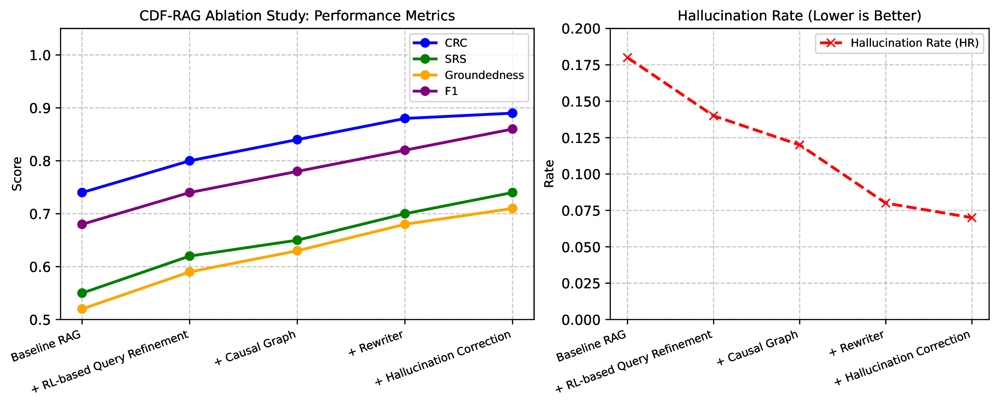

# CDF-RAG: Causal Dynamic Feedback for Adaptive Retrieval-Augmented Generation

**Elahe Khatibi\***, **Ziyu Wang\***, Amir M. Rahmani  
*University of California, Irvine*  
📄 [arXiv:2504.12560](https://arxiv.org/abs/2504.12560)  
\* Equal contribution


---

## 🧠 Abstract

Retrieval-Augmented Generation (RAG) has significantly enhanced large language models (LLMs) in knowledge-intensive tasks by incorporating external knowledge retrieval. However, existing RAG frameworks primarily rely on semantic similarity and correlation-driven retrieval, limiting their ability to distinguish true causal relationships from spurious associations. This results in responses that may be factually grounded but fail to establish cause-and-effect mechanisms, leading to incomplete or misleading insights. To address this issue, we introduce Causal Dynamic Feedback for Adaptive Retrieval-Augmented Generation (CDF-RAG), a framework designed to improve causal consistency, factual accuracy, and explainability in generative reasoning. CDF-RAG iteratively refines queries, retrieves structured causal graphs, and enables multi-hop causal reasoning across interconnected knowledge sources. Additionally, it validates responses against causal pathways, ensuring logically coherent and factually grounded outputs. We evaluate CDF-RAG on four diverse datasets, demonstrating its ability to improve response accuracy and causal correctness over existing RAG-based methods.

---

## 🏗️ Repository Structure

```
CDF-RAG/
├── agents/               # Core modules (retrieval, rewriting, RL, hallucination detection)
├── data/                 # Dataset processing scripts and Jupyter notebooks
├── eval/                 # Evaluation metrics and scoring scripts
├── finetune/             # Scripts for fine-tuning LLaMA, Mistral, FLAN-T5
├── main/                 # Pipeline runner and ablation experiments
├── figs/                 # Key figures from paper (use .png for rendering)
├── config.py             # Centralized configuration & env variables
├── requirements.txt      # Python dependencies
└── README.md             # You're here
```

---

## 🚀 Getting Started

### Installation

```bash
git clone https://github.com/elakhatibi/CDF-RAG.git
cd CDF-RAG
pip install -r requirements.txt
```

### Environment Setup

Create a `.env` file or export these:

```
OPENAI_API_KEY=your-openai-key
PINECONE_API_KEY=your-pinecone-key
NEO4J_URI=bolt://localhost:7687
NEO4J_USER=neo4j
NEO4J_PASSWORD=your-password
```

---

## 💡 CDF-RAG System Architecture

The CDF-RAG framework is composed of:
- **RL-based query refinement** (PPO)
- **Dual-path document retrieval** using:
  - Semantic similarity from Pinecone
  - Causal graphs from Neo4j
- **Knowledge rewriting** via GPT
- **Hallucination detection & correction** using LLM verification


---

## 📈 Key Results

### 🔬 Table 1: QA Performance

| Model         | PubMedQA | HotpotQA | NarrativeQA |
|---------------|----------|----------|--------------|
| Vanilla RAG   | 66.8     | 58.2     | 40.3          |
| ReAct         | 67.1     | 60.5     | 41.2          |
| BoT           | 66.7     | 59.9     | 41.1          |
| **CDF-RAG**   | **69.4** | **63.6** | **43.5**      |

CDF-RAG outperforms all RAG baselines across biomedical, open-domain, and long-form QA.

---

### ⚙️ Table 2: Ablation Study

| Setting                      | PubMedQA | HotpotQA | NarrativeQA |
|-----------------------------|----------|----------|-------------|
| – causal reward             | 67.5     | 61.3     | 42.1        |
| – semantic alignment        | 67.9     | 61.5     | 42.4        |
| – hallucination detection   | 68.2     | 61.9     | 42.5        |
| **Full CDF-RAG (ours)**     | **69.4** | **63.6** | **43.5**    |

CDF-RAG benefits from all reward components, showing the value of causal and semantic alignment.

---

### 🎯 Figure: Reward Contributions & Retrieval Quality

> If saved as PNG, embed with:



- Training with causal chain depth, hallucination penalty, and SRS increases retrieval and reasoning quality.
- Retrieval improves over epochs — even without ground truth supervision.

---

## 🧪 Evaluation Metrics

- `CRC`: Causal Retrieval Coverage
- `CCD`: Causal Chain Depth
- `SRS`: Semantic Refinement Score
- `Groundedness`: Final answer ↔ retrieved docs
- `HR`: Hallucination Rate
- `F1`, `Precision`, `Recall`: (if hallucination labels available)

---

## 🔄 Run the Pipeline

### Run a Query

```bash
python main/cdf_rag_pipeline.py "Why do patients miss appointments?"
```

### Evaluate Batch of Queries

```bash
python main/evaluate_batch_queries.py
python eval/evaluate_metrics.py
```

### Run Ablation Study

```bash
python main/Ablation_study.py
```

---

## 🏋️‍♂️ Fine-Tuning Instructions

To fine-tune LLaMA, Mistral, or FLAN-T5:

```bash
cd finetune/
python finetune_mistral_qlora.py      # or flan/llama variant
```

All models are instruction-tuned using the same format (instruction/input/output) on causal QA refinement data.

---

## 📎 Citation

```bibtex
@misc{khatibi2025cdfrag,
    title={CDF-RAG: Causal Dynamic Feedback for Adaptive Retrieval-Augmented Generation},
    author={Elahe Khatibi and Ziyu Wang and Amir M. Rahmani},
    year={2025},
    eprint={2504.12560},
    archivePrefix={arXiv},
    primaryClass={cs.CL}
}
```

---

## 📬 Contact

For questions or collaborations, feel free to reach out:

- 💬 Elahe Khatibi — ekhatibi@uci.edu  
- 💬 Ziyu Wang — ziyuw31@uci.edu  

---

## ❤️ Acknowledgments

This work was supported by the HealthSciTech group at UC Irvine. We thank the LangGraph and open-source LLM communities for inspiration and tooling.

---
